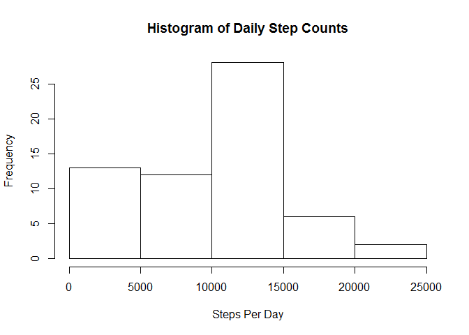
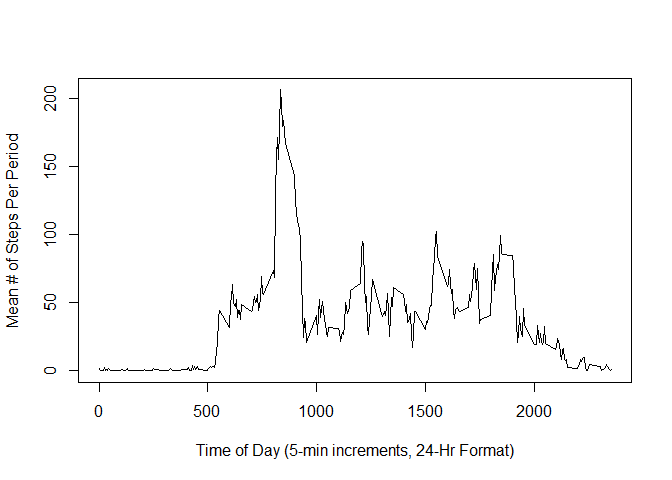
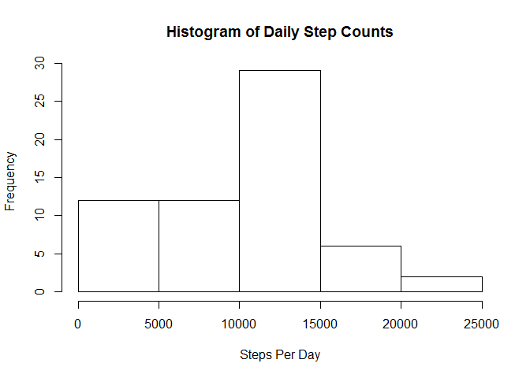
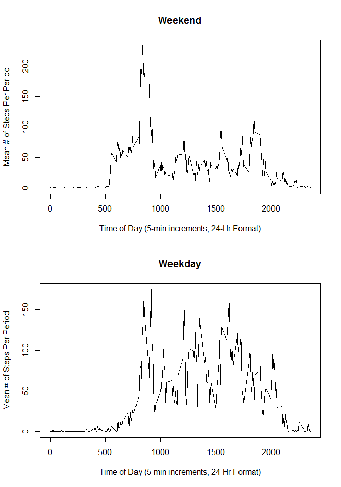

# Reproducible Research: Peer Assessment 1


## Loading and preprocessing the data

If the data has not yet been unzipped, unzip it.
Then load the activity data using read.csv().


```r
if ( !file.exists("activity.csv") ) {
  unzip("activity.zip")
}
dailyActivity <- read.csv("activity.csv",header=TRUE)
# 
stepsByDay <- data.frame(dailyStepCount=with(dailyActivity,tapply(steps,date,sum,na.rm=T)))
intervalSum <- with(dailyActivity,tapply(steps,interval,sum,na.rm=T))
intervalMean <- with(dailyActivity,tapply(steps,interval,mean,na.rm=T))
stepsByInterval <- data.frame(interval=names(intervalSum),total=intervalSum,average=intervalMean)
```

## What is mean total number of steps taken per day?


```r
hist(stepsByDay$dailyStepCount,xlab="Steps Per Day",main="Histogram of Daily Step Counts")
```

<!-- -->

```r
#
# Do not need to specify na.rm = T in the next two statements because
# that was already handled in the sum() calculation of tapply()
mean(stepsByDay$dailyStepCount)
```

```
## [1] 9354.23
```

```r
median(stepsByDay$dailyStepCount)
```

```
## [1] 10395
```

## What is the average daily activity pattern?


```r
plot(x=row.names(stepsByInterval),y=stepsByInterval$average,type='l',xlab="Time of Day (5-min increments, 24-Hr Format)",ylab="Mean # of Steps Per Period")
```

<!-- -->

The five-minute period with the greatest number of steps on average is: 


```r
row.names(subset(stepsByInterval, total == max(stepsByInterval$total)))
```

```
## [1] "835"
```


## Imputing missing values

The number of rows with NA values for the step count in the activity data set is:


```r
 sum(is.na(dailyActivity$steps))
```

```
## [1] 2304
```

In order to replace the NA values with real data, we will replace each NA with the average of the corresponding 5-minute period.  We start off by making a copy of the dailyActivity data and call it "dat".  Then we populate the NA values with the corresponding average for the interval from the stepsByInterval data frame.


```r
dat <- data.frame(dailyActivity)
dat <- transform(dat, steps = ifelse(is.na(steps), stepsByInterval[interval == interval,]$average, steps))
```


```r
datStepsByDay <- data.frame(dailyStepCount=with(dat,tapply(steps,date,sum,na.rm=T)))
hist(datStepsByDay$dailyStepCount,xlab="Steps Per Day",main="Histogram of Daily Step Counts")
```

<!-- -->

```r
#
# Do not need to specify na.rm = T in the next two statements because
# that was already handled in the sum() calculation of tapply()
mean(datStepsByDay$dailyStepCount)
```

```
## [1] 9530.724
```

```r
median(datStepsByDay$dailyStepCount)
```

```
## [1] 10439
```

These values are higher than the previous values because we have added 
steps to the count overall.  

## Are there differences in activity patterns between weekdays and weekends?


```r
datDay <- transform(dat, dayType =  ifelse(startsWith(weekdays(as.Date(date)),"S"),"weekend","weekday"))
dayFactor <- factor(datDay$dayType)
dayDat <- transform(datDay, dayType = dayFactor)

weekendActivity <- subset(dayDat,dayType == "weekend")
weekdayActivity <- subset(dayDat,dayType == "weekday")

weekendIntervalMean <- with(weekendActivity,tapply(steps,interval,mean,na.rm=T))
weekdayIntervalMean <- with(weekdayActivity,tapply(steps,interval,mean,na.rm=T))
weekdayStepsByInterval <- data.frame(interval=names(weekendIntervalMean),average=weekendIntervalMean)
weekendStepsByInterval <- data.frame(interval=names(weekdayIntervalMean),average=weekdayIntervalMean)

library(lattice)
par(mfrow=c(2,1))
plot(x=row.names(weekendStepsByInterval),y=weekendStepsByInterval$average,type='l',xlab="Time of Day (5-min increments, 24-Hr Format)",ylab="Mean # of Steps Per Period",main="Weekend")
plot(x=row.names(weekdayStepsByInterval),y=weekdayStepsByInterval$average,type='l',xlab="Time of Day (5-min increments, 24-Hr Format)",ylab="Mean # of Steps Per Period",main="Weekday")
```

<!-- -->

These plots show present a clear difference in step-related activity between weekends and weekdays.
